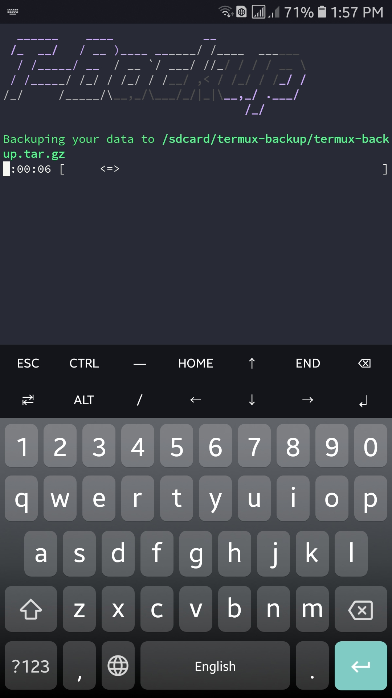
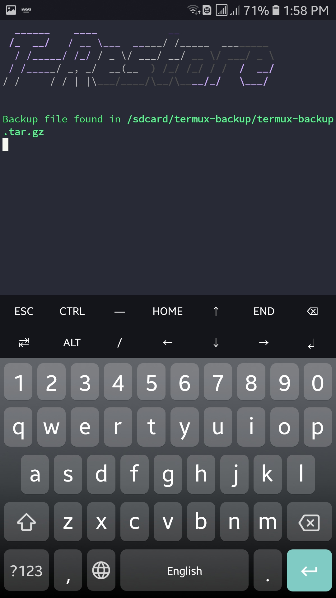

# Termux Backup

Simple program to backup and restore your termux data to internal storage.
<br>
Backuping is important because you don't wanna run<br>
```bash
apt update && apt upgrade
```
everytime you install Termux.
<br>
<br>
<br>
Installation:<br>
1)Clone this repo and cd to termux-backup
```bash
git clone https://github.com/msn-05/termux-backup.git
cd termux-backup
```
2)Give executable permissions to install
```bash
chmod +x install
```
3)Run install
```bash
./install
```

Usage:<br>
To backup your data to /sdcard/termux-backup (here sdcard is Internal storage) just type:
```bash
backup
```
To restore your data from /sdcard/termux-backup type:
```bash
restore
```
